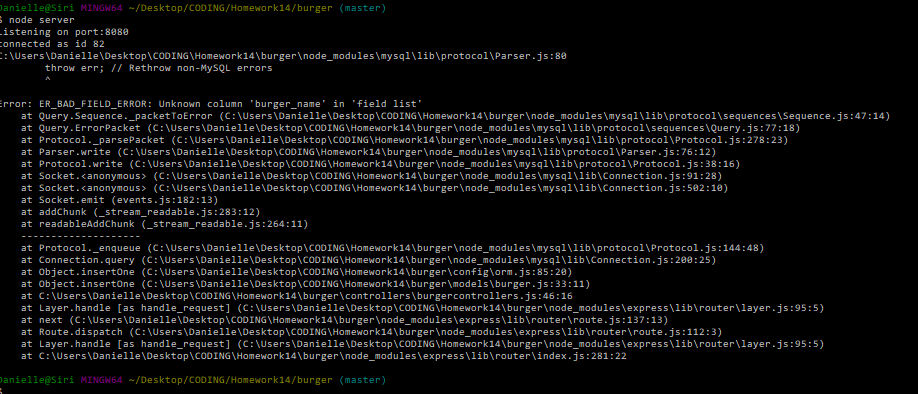

# burger README

* "In this assignment, you'll create a burger logger with MySQL, Node, Express, Handlebars and a homemade ORM (yum!). Be sure to follow the MVC design pattern; use Node and MySQL to query and route data in your app, and Handlebars to generate your HTML."

* Node, MySQL, Express and Handlebars will all be used.

* schema.sql

* * create database for burgers
* * use database
* * create table based on database

* seeds.sql

* * writer at least three Insert Queries for the burgers table

* run SQL files (ASK TA)

* Connection.js

* * require mySQL
* * export (via "module.exports")

* ORM.js

* * import connection into orm (use 'require' function)
* * selectAll, insertOne, and updateOne functions
* * * create "querystring" variable
* * export (via "module.exports")

* burger.js

* * import connection into orm (use 'require' function)
* * selectAll, insertOne, and updateOne functions based on orm.js
* * export (via "module.exports")

* burgercontrollers.js

* * import express and burger.js
* * selectAll, insertOne, and updateOne functions based on orm.js
* * export router

* * 

* * 

error i received whenever i tried to add a new burger. couldn't figure it out.